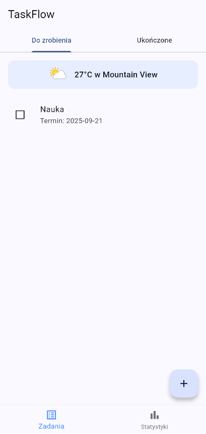

# Taskflow

<p align="center">
  
</p>

> **Disclaimer:** The application is currently available in Polish only.


Prosta, open-source'owa aplikacja do zarządzania zadaniami, stworzona we Flutter, która pomoże Ci zorganizować swój dzień.

## Zrzut ekranu

| Ekran Główny |
| :---: |
|  |

## Funkcje

* **Zarządzanie zadaniami**: Dodawaj, edytuj i oznaczaj zadania jako ukończone.
* **Powiadomienia o terminach**: Otrzymuj przypomnienia o zbliżających się zadaniach.
* **Statystyki**: Śledź swoją produktywność i sprawdzaj, w które dni jesteś najbardziej efektywny.
* **Integracja z pogodą**: Zobacz aktualną pogodę w swojej lokalizacji bezpośrednio w aplikacji.
* **Nowoczesny interfejs**: Czysty i przyjazny dla użytkownika interfejs zbudowany z użyciem Flutter.
* **Lokalne przechowywanie**: Twoje zadania są bezpiecznie przechowywane na urządzeniu.

## Konfiguracja

Aby korzystać z funkcji pogody, potrzebujesz klucza API z [WeatherAPI](https://www.weatherapi.com/).

1.  **Zdobądź klucz API**:
    * Przejdź na stronę [WeatherAPI.com](https://www.weatherapi.com/) i załóż darmowe konto.
    * Skopiuj swój klucz API z panelu nawigacyjnego.

2.  **Zainstaluj aplikację**:
    * Przejdź do strony [Releases](https://github.com/iamalbedo1/taskflow/releases) tego repozytorium.
    * Pobierz najnowszy plik `.apk`.
    * Zainstaluj plik APK na swoim urządzeniu z systemem Android.

3.  **Skonfiguruj aplikację**:
    * Uruchom aplikację.
    * Aplikacja poprosi o podanie klucza API, aby móc wyświetlać informacje o pogodzie. Wklej swój klucz w odpowiednie pole.

## Budowanie ze źródła

Jeśli chcesz samodzielnie zbudować projekt, postępuj zgodnie z poniższymi krokami:

1.  Sklonuj repozytorium:
    ```bash
    git clone [https://github.com/iamalbedo1/taskflow.git](https://github.com/iamalbedo1/taskflow.git)
    ```
2.  Otwórz projekt w edytorze kodu (np. VS Code lub Android Studio z pluginem Flutter).
3.  Upewnij się, że masz zainstalowane [Flutter SDK](https://flutter.dev/docs/get-started/install).
4.  Uruchom `flutter pub get`, aby pobrać wymagane zależności.
5.  Zbuduj i uruchom aplikację na emulatorze lub fizycznym urządzeniu.

